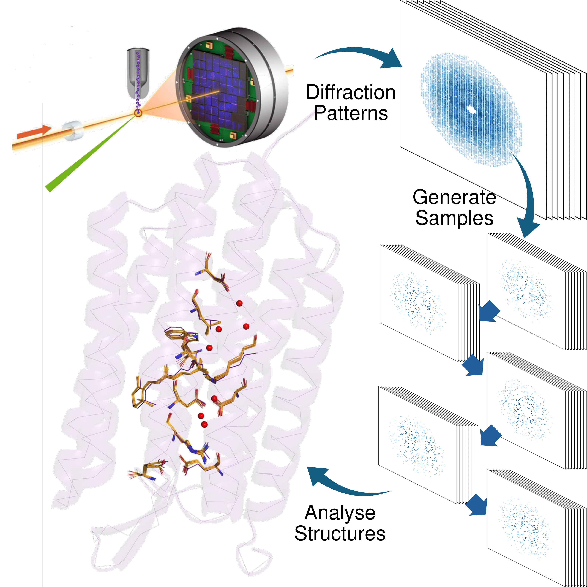

# Resampling of X-ray serial crystallography data
[](https://doi.org/10.5281/zenodo.14921798)

This repository contains tools for the resampling of diffraction patterns from 
CrystFEL streams to analyse coordinate errors and Fourier electron density maps 
in time-resolved serial crystallography (TR-SX) data.<br>



If you find these tools useful, please cite the following publication:
> [A. Vallejos, G. Katona, and R. Neutze, "Appraising protein conformational changes by resampling time-resolved serial x-ray crystallography data". *Struct. Dyn.* **11**, 044302 (2024)](https://doi.org/10.1063/4.0000258)


## CONTENTS

- Main
    - `xshuffle.py`
    - `parameters.yml`
    - `process.sh`
    - `phenix_por.params`

- Secondary
    - `run_polder.sh`
    - `run_fofo.sh`
    - `svd_samples.ipynb`
    - `run_x8.sh`
    - `maptool-resampling/`

## REQUIREMENTS
The scripts integrate libraries and programs from multiple software suites. 
Ensure you have these installed:
- [CCP4 8.0.015](https://www.ccp4.ac.uk/)
- [cctbx 2022.4](https://cctbx.github.io/)
- [Phenix 1.19.2-4158](https://phenix-online.org/)
- [CrystFEL 0.10.1](https://www.desy.de/~twhite/crystfel/index.html)

> **IMPORTANT**<br>
> Users are responsible for obtaining the necessary licenses.

## USAGE
This is a command line tool developed using specific versions of software and 
libraries.<br>

To ensure compatibility and avoid execution errors, we strongly recommend to 
configure a conda environment using the provided `environment.yml`:
```bash
conda env create -f environment.yml
```

The simplest way to run this tool is to run it using a parameter file, a 
template is provided here:
```bash
./xshuffle.py --params=parameters.yml
```

Additionally, all parameters can be supplied either fully or partially via 
standard input (stdin) arguments. This is particularly useful for runing 
multiple jobs in parallel.

## EXAMPLE OUTPUT
Consider the following example run using a [publicly available dataset](https://www.cxidb.org/id-53.html):
```bash
./xshuffle.py --params=parameters.yml --stream='input/0.016usec-light.stream'
```
Once the job is completed, it will generate output files organized according to 
the following folder structure:
```bash
output/
├── rfree.log
├── rfree.mtz
├── 0.016usec-light/
│   ├── Bootstrap/
│   │   ├── clean.stream
│   │   ├── frame_loc.yml
│   │   ├── analysis_fofo_0_minus.mat
│   │   ├── analysis_fofo_0_plus.mat
│   │   ├── analysis_polder_0.mat
│   │   ├── svd_FoFo/
│   │   ├── 000/
.
.
.
        └── 099/
            ├── nframes.yaml
            ├── merge.hkl
            ├── merge.hkl.log
            ├── merge.mtz
            ├── merge.log
            ├── merge.hkl1
            ├── merge.hkl1.log
            ├── merge.hkl2
            ├── merge.hkl2.log
            ├── merge_check.dat
            ├── merge_check.log
            ├── merge_ccstar.dat
            ├── merge_ccstar.log
            ├── merge_rsplit.dat
            ├── merge_rsplit.log
            ├── merge_trunc.mtz
            ├── merge_trunc.log
            ├── merge_trunc_cad.mtz
            ├── merge_trunc_cad.log
            ├── merge_trunc_cad_uniq.mtz
            ├── merge_trunc_cad_uniq.log
            ├── merge_trunc_cad_uniq_data.mtz
            ├── merge_trunc_cad_uniq_001.eff
            ├── merge_trunc_cad_uniq_001.mtz
            ├── merge_trunc_cad_uniq_001.pdb
            ├── merge_trunc_cad_uniq_001.log
            ├── merge_trunc_cad_uniq_001_Fmodel.ccp4
            ├── analysis_fofo_0/
            └── analysis_polder_0/
```
The example above illustrates the generation of 100 resampled refined structures
using the Bootstrap method. Including post analysis of polder maps and isomorphous 
density maps with singular value decomposition.

## CONTACT

For questions or further information, please contact the authors:
- [Adams Vallejos](https://www.gu.se/en/about/find-staff/adamsvallejosdonoso)
- [Gergely Katona](https://www.gu.se/en/about/find-staff/gergelykatona)
- [Richard Neutze](https://www.gu.se/en/about/find-staff/richardneutze)

---
*Page written by Adams Vallejos <br>
